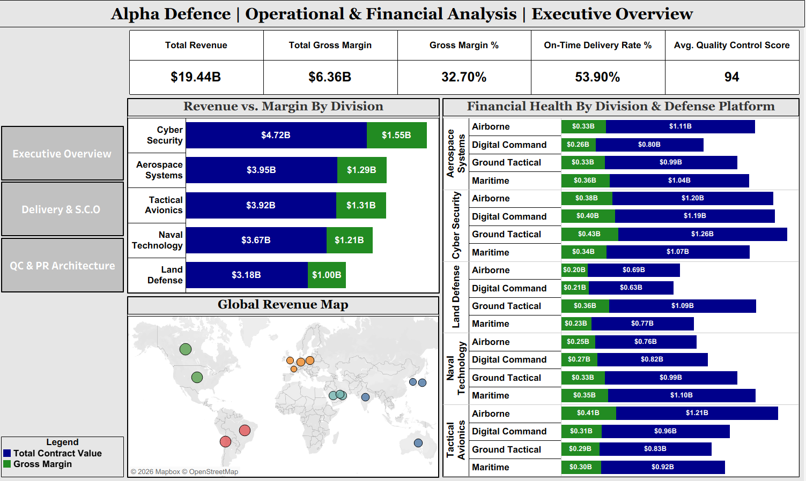
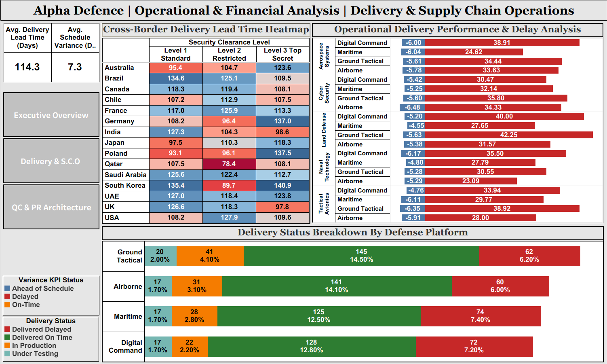
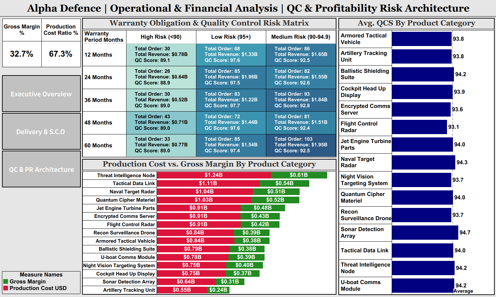

# Alpha Defence | Operational & Financial Performance Analysis

---

## Executive Overview:-

**Alpha Defence Pvt Ltd** is a premier defense enterprise manufacturing and delivering specialized hardware, digital systems, and strategic platforms across global markets—including Airborne, Digital Command, Ground Tactical, and Maritime defense applications. 

This repository contains an end-to-end operational, logistics, and financial analysis powered by an interactive **3-Page Tableau Executive Dashboard**. The project processes **1,000 historical defense Contracts** representing **$19.44 Billion in Total Contract Value** and **$6.36 Billion in Gross Margin** (32.70% overall gross margin). The analysis evaluates key business performance metrics, cross-border fulfillment lead times, security clearance compliance bottlenecks, quality control benchmarks, and multi-year warranty risk exposures.

---

## Project Summary:-
The **Alpha Defence Operational & Financial Performance Analysis** is an end-to-end enterprise Business Intelligence (BI) built for **Alpha Defence Pvt Ltd**, a global defense manufacturer and systems integrator. The project bridges raw operational procurement data with executive-level strategic decision-making.

### Business Context & Core Objectives:
Alpha Defence operates across global jurisdictions delivering critical defense assets (**Airborne Systems, Cyber Security, Land Defense, Naval Technology, and Tactical Avionics**). This project was initiated to address three critical operational bottlenecks:
  * **Financial Performance Tracking: **Granular analysis of a **$19.44B Total Contract Value** and **$6.36B Gross Margin (32.70% margin rate)** across 5 business divisions and 15 product lines.
  * **Supply Chain & Customs Bottlenecks:** Uncovering the root causes behind a low **53.90% On-Time Delivery Rate** and diagnosing extended cross-border lead times **114.3 days average** across Security Clearance Levels 1 through 3.
  * **Quality Control & Warranty Exposure:** Identifying post-delivery financial liabilities by evaluating a **67.3% Production Cost Ratio** against **162 high-risk orders** (<90 Quality Score) tied to multi-year warranty obligations (up to 60 months).

### Technical & Analytical Deliverables:
  1. **Interactive 3-Page Tableau Suite:** Engineered a multi-dashboard architecture featuring custom calculated fields, dynamic parameter controls, KPI variance alerts, and integrated Mapbox GIS spatial mapping.
  2. **Stakeholder Executive Report:** Synthesized visual analytics into a comprehensive, tabular-free business evaluation report outlining targeted recommendations for customs pre-clearance and factory acceptance quality gates.
  3. **Stakeholder Executive Presentation:** Synthesized visual analytics into a comprehensive, text-dense business evaluation report outlining targeted recommendations for customs pre-clearance and factory acceptance quality gates.

---

## Dataset Description (Processed Data):-

The underlying dataset contains comprehensive operational, financial, and logistical details for **1,001 defense equipment contracts**.
  * **Entity Name:** Alpha Defence Pvt Ltd
  * **Industry:** Defense Hardware, Security & Aerospace Contracting
  * **Total Records:** 1,001 rows
  * **Total Columns:** 21 columns

### Columns Name (Processed Data):-

1. **Order ID**: Unique alphanumeric identifier for each defense procurement order (e.g., ORD-10000).
2. **Contract Number**: Unique legal contract reference code (e.g., ALPHA-CNT-2023-412).
3. **Client Name**: Name of the purchasing ministry or government defense agency (e.g., Ministry of Defense - Japan).
4. **Client Region**: Geopolitical region of the customer (Asia Pacific, Europe, Americas, Middle East, etc.).
5. **Delivery Country**: Final destination country for contract hardware delivery.
6. **Division**: Business unit responsible for manufacturing (Cyber Security, Aerospace Systems, Tactical Avionics, Naval Technology, Land Defense).
7. **Product Category**: Specific defense hardware/software product line (e.g., Threat Intelligence Node, Sonar Detection Array).
8. **Defense Platform**: Military operational domain (Airborne, Digital Command, Ground Tactical, Maritime).
9. **Serial Number**: Unique manufacturing hardware serial designation.
10. **Order Date**: Calendar date when the contract was officially executed.
11. **Scheduled Delivery Date**: Contractual deadline for delivery fulfillment.
12. **Actual Delivery Date**: Recorded calendar date of completed customer delivery.
13. **Unit Price USD**: Selling price per single hardware unit in US Dollars.
14. **Quantity Ordered**: Total number of units manufactured and delivered under the contract.
15. **Total Contract Value USD**: Total revenue generated by the contract (**Unit Price USD** × **Quantity Ordered**).
16. **Production Cost USD**: Total manufacturing, labor, and materials cost incurred by Alpha Defence.
17. **Gross Margin USD**: Net profit generated prior to overhead (**Total Contract Value USD** - **Production Cost USD**).
18. **Quality Control Score**: Internal QA score assigned prior to dispatch (Scale: 0.0 to 100.0).
19. **Security Clearance Level**: Mandated military security protocol (Level 1 Standard, Level 2 Restricted & Level 3 Top Secret).
20. **Delivery Status**: Fulfillment outcome status (Delivered On Time, Delivered Delayed, In Production, Under Testing).
21. **Warranty Period Months**: Post-delivery operational guarantee duration (12, 24, 36, 48, or 60 Months).

---

## Tools Used:-

* **Google Sheets**
* **AI (Gemini)**
* **Tableau Desktop**
* **Google Docs**
* **Google Slides**

---

## Dashboard Preview:-





---

## Project Structure:-
```
Alpha_Defence_Operational_And_Financial_Analysis/
│
├── 1_Processed_Data/
│   └── Alpha_Defence_Data.csv 
│
├── 2_Business_Objective/
│   └── Business_Objectives.pdf
│
├── 3_Dashboard/
│   ├── Alpha_Defence_Operational_And_Financial_Analysis.twb
│   ├── Alpha_Defence_Operational_And_Financial_Analysis.twbx
│   └── Dashboard_Screenshots/
│       ├── 1_Executive_Overview.png
│       ├── 2_Delivery_&_Supply_Chain_Operations.png
│       └── 3_QC_&_Profitability_Risk_Architecture.png
│
├── 4_Business_Report/
│   └── Alpha_Defence_Operational_And_Financial_Analysis_Report.pdf
│
├── 5_Presentation/
│   ├── Alpha_Defence_Operational_And_Financial_Analysis_Presentation.pdf
│   └── Alpha_Defence_Operational_And_Financial_Analysis_Presentation.pptx
│
└── README.md    
```

## Dirct File View:-

1. [**Processed Data (CSV)**](1_Processed_Data/Alpha_Defence_Data.csv)
2. [**Business Objectives (PDF)**](2_Business_Objective/Business_Objectives.pdf)
3. [**Dashboard (Folder)**](3_Dashboard)
4. [**Alpha Defence Operational And Financial Analysis Report (PDF)**](4_Business_Report/Alpha_Defence_Operational_And_Financial_Analysis_Report.pdf)
5. [**Presentation (Folder)**](5_Presentation)
   - [**Alpha Defence Operational And Financial Analysis Presentation (PDF)**](5_Presentation/Alpha_Defence_Operational_And_Financial_Analysis_Presentation.pdf)
   - [**Alpha Defence Operational And Financial Analysis Presentation (PPTX)**](5_Presentation/Alpha_Defence_Operational_And_Financial_Analysis_Presentation.pptx)

---

## Author:-
**Yash R. Sonar** | Aspiring Data Analyst

---
